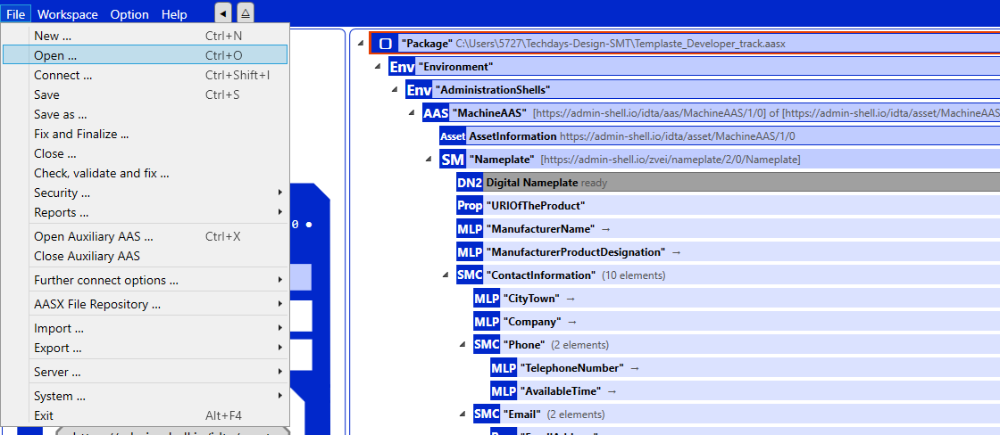
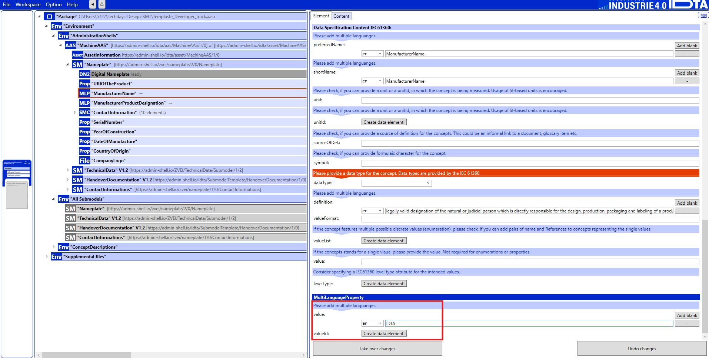

# Motivation - Design a Submodel Template
Asset Administration Shell (AAS) provides a standardized way to describe assets through submodel templates, ensuring clear and interoperable asset management. 
This track helps participants learn how to design submodel templates using AAS Package Explorer (AASPE) and apply them to real-world use cases. 

## Overview

This developer-track focuses on below points:

- Submodel Template Standard Process and Design.
- Modelling of AAS using AASPE.

This track is designed to familiarize you with the process of designing submodel templates and how to standardize them through the IDTA process. Additionally, you'll learn how to model submodel templates using the AAS Package Explorer.

## Tutorial - Modelling an AAS for a Packaging Machine

To instantiate an AAS (Asset Administration Shell) SubModel for a battery, you would typically define the SubModel and its SubModelElements. The properties can be represented as specific data elements within the SubModel, each having metadata like value type, units, and other characteristics.

Below is an example of a description for instantiating an AAS SubModel for a battery, with the specified propertie

## Step 1: Open AASPE and Load the Template

- Open AAS Package Explorer (AASPE).
- Load the provided AAS template file: [Here](TemplateAAS.aasx)

### Prerequisites

1. Laptop

2. Installed AASX Package Explorer (You can install it from [here](https://github.com/eclipse-aaspe/package-explorer/releases/download/v2024-06-10.alpha/aasx-package-explorer.2024-06-10.alpha.zip)) - (v.2024-06-10).

## Step 2: Fill in the Submodel Information
Use the information provided below (section 2 - Breakdown of the Submodel) to fill in the necessary values

## Step 3: Save the Submodel Template
- Once you've entered all the required data, save the AAS template for future use and integration.

- File > Save your completed AAS file.(as AASX or JSON file)

**Important !** Please ensure that the semantic IDs for each element are generated according to the pattern described above. Output the structure as a downloadable JSON file.

## Breakdown of the SubModel Components

### SubModel Attributes

- **id**: `"https://irt-systemx.fr/ids/aas/battery-001"`  
  A unique identifier for the battery SubModel.

- **idShort**: `"BatterySubModel"`  
  A human-readable, shorter identifier for the SubModel.

- **semanticId**: `"https://irt-systemx.fr/ids/aas/semantic/battery"`  
  The semantic identifier for this SubModel, used for linking external references and providing meaning to the SubModel.

- **kind**: `"Instance"`  
  Defines that this SubModel is an instance of a battery (rather than a template or type).

---

### SubModel Elements

Each SubModel element represents a specific property or characteristic of the battery. Below is a description of each element:

#### 2.2.1 **Voltage_measured**
- **idShort**: `"Voltage_measured"`
- **semanticId**: `"https://irt-systemx.fr/ids/aas/semantic/voltage_measured"`
- **valueType**: `"float"`
- **value**: `3.7`
- **unit**: `"V"`  
  Represents the measured voltage of the battery.

#### 2.2.2 **Current_measured**
- **idShort**: `"Current_measured"`
- **semanticId**: `"https://irt-systemx.fr/ids/aas/semantic/current_measured"`
- **valueType**: `"float"`
- **value**: `1.2`
- **unit**: `"A"`  
  The current drawn from the battery at the moment of measurement.

#### 2.2.3 **Temperature_measured**
- **idShort**: `"Temperature_measured"`
- **semanticId**: `"https://irt-systemx.fr/ids/aas/semantic/temperature_measured"`
- **valueType**: `"float"`
- **value**: `25.0`
- **unit**: `"°C"`  
  Indicates the measured temperature of the battery.

#### 2.2.4 **Current_charge**
- **idShort**: `"Current_charge"`
- **semanticId**: `"https://irt-systemx.fr/ids/aas/semantic/current_charge"`
- **valueType**: `"float"`
- **value**: `1.5`
- **unit**: `"A"`  
  Represents the current applied to charge the battery.

#### 2.2.5 **Voltage_charge**
- **idShort**: `"Voltage_charge"`
- **semanticId**: `"https://irt-systemx.fr/ids/aas/semantic/voltage_charge"`
- **valueType**: `"float"`
- **value**: `4.0`
- **unit**: `"V"`  
  The voltage used while charging the battery.

#### 2.2.6 **Time**
- **idShort**: `"Time"`
- **semanticId**: `"https://irt-systemx.fr/ids/aas/semantic/time"`
- **valueType**: `"string"`
- **value**: `"2024-09-28T14:30:00Z"`
- **unit**: `"ISO8601"`  
  The timestamp representing when the data was collected.

#### 2.2.7 **Capacity**
- **idShort**: `"Capacity"`
- **semanticId**: `"https://irt-systemx.fr/ids/aas/semantic/capacity"`
- **valueType**: `"float"`
- **value**: `2.5`
- **unit**: `"Ah"`  
  The battery capacity, measured in ampere-hours (Ah).

#### 2.2.8 **id_cycle**
- **idShort**: `"id_cycle"`
- **semanticId**: `"https://irt-systemx.fr/ids/aas/semantic/id_cycle"`
- **valueType**: `"int"`
- **value**: `45`  
  The battery's cycle number, representing the number of charge-discharge cycles completed.

#### 2.2.9 **type**
- **idShort**: `"type"`
- **semanticId**: `"https://irt-systemx.fr/ids/aas/semantic/type"`
=- **valueType**: `"string"`
- **value**: `"Li-ion"`  
  The type of battery (in this case, a lithium-ion battery).

#### 2.2.10 **ambient_temperature**
- **idShort**: `"ambient_temperature"`
- **semanticId**: `"https://irt-systemx.fr/ids/aas/semantic/ambient_temperature"`
- **valueType**: `"float"`
- **value**: `22.0`
- **unit**: `"°C"`  
  The ambient temperature around the battery.

#### 2.2.11 **Battery**
- **idShort**: `"Battery"`
- **semanticId**: `"https://irt-systemx.fr/ids/aas/semantic/battery"`
- **valueType**: `"string"`
- **value**: `"Battery1234"`  
  The unique identifier for this particular battery.

## AAS Model Deployment

Send me your AAS model (in json or AASX format) by email to: abdelhadi.belfadel@univ-lyon2.fr

The model will be deployed and an IP address will be provided to get access to your AAS model and submodel elements.
